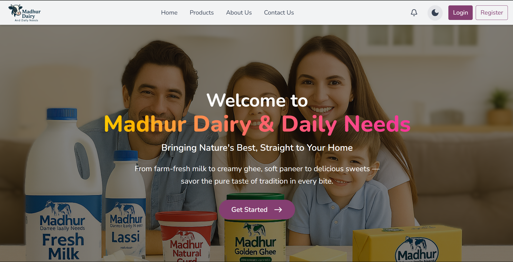

# Madhur Dairy & Daily Needs – Real-Time MERN Stack Based Dairy Products Platform 

## 📌 About the Project

**Madhur Dairy** is a full-featured dairy product selling platform built using the **MERN Stack** (MongoDB, Express.js, React.js, Node.js). It includes secure authentication, real-time ordering, online payments, product reviews, admin management, and more.

> ⚙️ Simulates a real-world e-commerce system with deep integration of modern tools like Socket.IO, EmailJS, Google OAuth, Cloudinary, and Razorpay.

---

## 🔧 Tech Stack

### 🖥️ Frontend (React + Vite)
- React.js, Vite
- Tailwind CSS, Material UI
- Chart.js (Admin analytics)
- EmailJS (OTP)
- Google OAuth
- Razorpay (Test)
- Cloudinary
- Fully Responsive

### ⚙️ Backend (Node.js + Express)
- Express + Node.js
- MongoDB + Mongoose
- JWT & bcryptjs Auth
- Socket.IO (real-time)
- Modular REST APIs

---

## 🛒 Core Features

### 👤 User Side
- Register/Login (Google or Email)
- OTP verification via EmailJS
- Browse & filter products
- Cart management
- Place real-time orders
- Live notifications (order status)
- Reviews and ratings
- Razorpay or COD payment
- View order history and profile

### 🛠️ Admin Panel
- Real-time admin dashboard
- Accept/Reject orders
- Manage inventory (CRUD)
- Analytics with Chart.js
- Customer reviews handling
- Notifications for new/canceled orders

---

##  Connect With Me
If you're working on something similar, have questions, or want to collaborate, feel free to connect! I’d love to hear from you. 🚀

- [LinkedIn](https://www.linkedin.com/in/aditya-soni-440a95366/)
- [Email](mailto:aadityasoni585@gmail.com)

